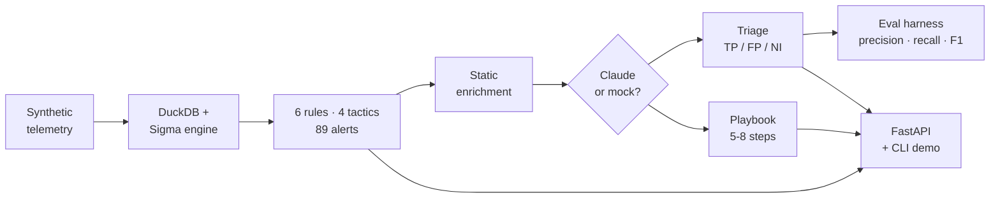
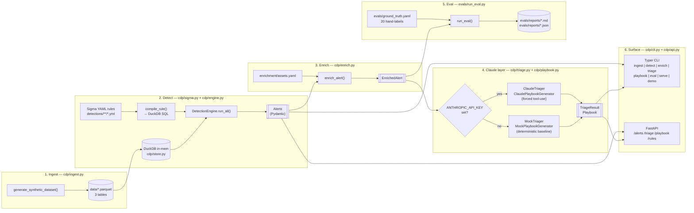

# Architecture

Design notes for `claude-detection-platform`. The short version: **detection rules in YAML, telemetry in Parquet, SQL in DuckDB, structured output from Claude via forced tool-use, and the whole thing measured by a hand-labeled eval harness that runs without an API key.**

## Goals

1. **Demonstrate end-to-end D&R engineering**, not a single surface. Every phase (ingest → detect → enrich → triage → playbook → eval → API) is wired to the one above and below it.
2. **Run hermetically** — synthetic data, offline mocks, deterministic seeds. A reviewer can clone, `docker compose build`, and see every output in under five minutes with zero credentials.
3. **Make AI use measurable**, not anecdotal. The eval harness produces precision/recall/F1 for both `true_positive` and `false_positive` labels so Claude's lift over the mock baseline is a number, not a vibe.

## Pipeline flow

A single alert's journey through the platform, at a glance:

## System diagram

A detailed view of the same pipeline with module names and data shapes:

## Module map

| Module | Responsibility |
|---|---|
| `cdp/ingest.py` | Deterministic synthetic telemetry generator. Emits three Parquet tables — `windows_process_creation`, `authentication`, `aws_cloudtrail` — with planted attacks (Tor brute-force, encoded PowerShell, Office → WScript, `sc.exe create`, `AttachUserPolicy`, large S3 `GetObject`) buried in benign noise, plus deliberately-benign-but-rule-firing events that give the eval a real TP-vs-FP signal. |
| `cdp/store.py` | Thin `DuckDB` wrapper. Loads Parquet as views, validates table names with a regex allow-list, runs parameterized queries. |
| `cdp/sigma.py` | Sigma subset compiler. Parses YAML → `SigmaRule`; compiles `detection` + `condition` → a safe DuckDB `WHERE` clause with `?` placeholders. Supports `contains|startswith|endswith|re|gt|gte|lt|lte` modifiers, list OR-expansion, and the full boolean condition grammar (`and`/`or`/`not`/parens/`1 of pat`/`all of pat`/`them`). |
| `cdp/engine.py` | `DetectionEngine.run_all()` — resolves logsource, runs each rule's compiled SQL, emits `Alert`s with deterministic ids (`rule_id-sha256(matched_event)[:12]`). |
| `cdp/enrich.py` | Static enrichment: public/private IP classification, asset criticality + owner lookup from `enrichment/assets.yaml`, threat-intel hit matching. |
| `cdp/prompts.py` | Claude system prompts, tool schemas (`report_triage`, `submit_playbook`), and the `render_alert_context` helper that wraps untrusted event content in clearly-delimited sections. |
| `cdp/triage.py` | `Triager` Protocol; `ClaudeTriager` (Anthropic SDK, forced tool-use) and `MockTriager` (severity + keyword + IP + criticality heuristic). `make_triager()` picks one by inspecting `Settings.has_anthropic_key`. |
| `cdp/playbook.py` | Same shape as triage: Protocol + Claude + mock + factory. Mock uses per-rule templates with safe placeholder substitution so missing event fields render as `(unknown …)` rather than `KeyError`. |
| `cdp/api.py` | FastAPI app. Lazy pipeline: first request triggers ingest + detection; subsequent requests hit the in-memory cache. `APIState` is injectable for tests. |
| `cdp/cli.py` | Typer CLI. One subcommand per phase: `ingest`, `detect`, `validate`, `enrich`, `triage`, `playbook`, `eval`, `serve`, `demo`, `version`. |
| `evals/run_eval.py` | End-to-end harness. Loads ground truth, runs one or more triagers, computes 3-way confusion matrix, TP-class + FP-class precision/recall/F1 under two collapse modes (`strict` vs `lenient`), renders Markdown + JSON. |

## Design decisions

### Why DuckDB (over Spark / Pandas / SQLite)

Detection queries are *analytical* and *join-free* in the Sigma subset — perfect shape for a columnar engine. DuckDB gives us vectorized execution, native Parquet, zero-config in-process use, and the same SQL dialect our rules compile to. There's no cluster to maintain and nothing to containerize separately. Re-running a rule against 50k events takes single-digit milliseconds; the whole 6-rule × 538-event detection sweep finishes in about 100 ms.

### Why Sigma (over a custom DSL)

Sigma is the industry-standard detection-as-code format. Every production SIEM I'd plausibly integrate with (Splunk, Elastic, Sentinel, Chronicle, Panther) can already consume Sigma via `sigmac` or a native converter. Building on Sigma means the rules in `detections/` are portable *out* of this project — they'd be useful even if someone throws away the rest of the platform. Writing a custom DSL would have been more fun but worse engineering.

### Why a *subset* of Sigma

The full spec is large, and most of what's outside the subset (`aggregations`, `near`, `timeframe`, `base64offset`, `utf16le`, `correlation`) needs either stateful windowing or bespoke transforms that fight with DuckDB's set-oriented model. The subset covered here — equality + the common modifiers, list OR-expansion, and the boolean condition grammar — is enough to write real detections for the three telemetry sources this project ingests. `detections/README.md` documents exactly what's in and what's out.

### Why forced tool-use (over prompt-and-parse)

Claude's `tool_choice={"type": "tool", "name": "<tool>"}` forces a single `tool_use` block whose `input` is server-side validated against our JSON schema. The alternative — asking for JSON in the prompt and parsing the text — fails under three real conditions: (1) the model wraps the JSON in prose, (2) the schema drifts silently when we add a field, (3) a prompt injection in the matched event convinces the model to emit a different shape. Forced tool-use is the cheapest structural guarantee Anthropic offers; the fallback path (model emits no tool block) raises `RuntimeError` rather than silently fabricating a verdict.

### Why a mock triager at all

Two reasons. **(a) Hermetic tests** — the entire test suite, including end-to-end CLI and API tests, runs without `ANTHROPIC_API_KEY`, without network, and deterministically. **(b) Eval baseline** — the mock's 70% strict accuracy / 0% FP-class recall is the floor the Claude path has to beat. Without a baseline, "Claude scored 85%" is an unfalsifiable claim; with the baseline, "Claude lifted FP-class F1 from 0% to X%" is.

### Why the eval harness ships a seed report

A reviewer shouldn't have to install anything, set a key, or pay for tokens to see the project's headline eval result. `evals/reports/seed-run.md` is a deterministic mock-only run checked into the repo — that's why `ground_truth.yaml`'s alert ids are pinned to the seeded dataset, and why `cdp/ingest.py` is deterministic byte-for-byte. The rest of `evals/reports/*` is `.gitignore`d so real runs don't clutter diffs.

### Why `cdp/` (not `platform/`)

`platform` shadows Python's stdlib `platform` module and makes every `import platform` ambiguous. `cdp` (for "Claude Detection Platform") is short, unambiguous, and reads well in imports (`from cdp.engine import DetectionEngine`).

### Why a separate `evals/` top-level dir

Evals are *about* the platform but aren't *part of* the deployable surface. Keeping them at the repo root — alongside `detections/`, `enrichment/`, and `infra/` (if it existed) — signals that these are assets, not library code. The `cdp eval` CLI subcommand sys.path-prepends the repo root so the separation is visible but not painful.

## Data-flow guarantees

- **Deterministic IDs.** Alert id = `rule_id-sha256(matched_event)[:12]`. Same dataset → same alerts → same ground-truth labels stay valid across runs.
- **Deterministic synthetic data.** `cdp/ingest.py` uses a single fixed `SYNTHETIC_SEED=42` and a fixed `BASE_TIME`. JSONL output is byte-for-byte identical across runs and platforms (enforced by a test in `tests/test_ingest.py`).
- **Safe SQL interpolation.** Table names come from a whitelist (`cdp.sigma.LOGSOURCE_MAP`, 3 entries) and are regex-checked in `cdp.store.Store`. All event-derived values flow through DuckDB `?` placeholders.
- **Prompt-injection defence.** System prompts instruct Claude to treat matched-event / context-event / enrichment content as untrusted. User-controlled fields are wrapped in clearly-delimited sections by `cdp.prompts.render_alert_context` and never concatenated into the system prompt itself.

## What the platform does *not* do (yet)

- **No streaming ingest.** Parquet is batch-oriented. A real deployment would put Kinesis / Kafka / Vector in front; this project is explicit about that boundary.
- **No stateful correlation.** No `near`, `timeframe`, or sequence rules. The current rule catalogue doesn't need it, and the honest call is to write those when a real detection needs them rather than speculate.
- **No persistence.** Alerts live in the DuckDB in-memory instance or the FastAPI `APIState` cache; there's no backing store. A production version would write `AlertEvent`s to whatever event bus the SOC already runs on.
- **No IaC in this checkout.** An earlier scope included a Terraform Lambda + API Gateway module; that's been descoped for this milestone in favour of tightening the eval harness and API surface. The code is structured so a Lambda adapter (e.g., Mangum over `cdp.api:app`) is a small add when it's wanted.
- **No authentication on the FastAPI surface.** It's a local demo. A real deployment would sit behind an API Gateway authorizer / SSO / mTLS, depending on the environment.

## Testing posture

- **Hermetic.** No network, no API key, no writes to the real `data/` dir. The `tmp_data_dir` fixture monkeypatches `CDP_DATA_DIR` per test and scrubs `ANTHROPIC_API_KEY`.
- **Fast.** The synthetic dataset is generated **once per pytest session** (`synthetic_dataset_dir`, session-scoped) and copied into per-test dirs via `shutil.copy2`. Full suite runs in ~10 s on a laptop.
- **Tight invariants.** Per-rule alert counts are pinned exactly (56 / 1 / 1 / 2 / 1 / 28 = 89) rather than soft floors. Anyone changing the dataset or detection semantics has to update the constant on purpose.
- **SDK stubbing over mocking.** `ClaudeTriager` / `ClaudePlaybookGenerator` tests replace the `anthropic` module with a stub via `patch.dict(sys.modules, ...)`, exercising the real SDK code path (including the `tool_use` extraction loop and the "no tool block" failure mode) without hitting the network.

See [`evals/README.md`](evals/README.md) for the eval methodology and [`detections/README.md`](detections/README.md) for the Sigma subset reference.
